# 📄 Informe de Análisis Exploratorio de Datos (EDA)

## Proyecto: Customer Churn – E-commerce  
**Autor:** Santiago Rodriguez  
**Rol:** Data Analyst / BI Analyst  

---

## 1. Objetivo del informe

Este informe documenta los resultados del **Análisis Exploratorio de Datos (EDA)** realizado sobre un conjunto de datos de clientes de e-commerce.

Los objetivos principales del EDA son:

- Comprender la **estructura y calidad** de los datos
- Explorar **distribuciones y segmentaciones**
- Identificar **patrones y anomalías**
- Analizar relaciones iniciales entre el comportamiento del cliente y el **churn**

⚠️ Este informe **no incluye** ingeniería de variables, modelado predictivo ni recomendaciones de negocio.

---

## 2. Descripción general del dataset

- **Registros iniciales:** 1.208  
- **Registros tras deduplicación:** 1.200  
- **Número de variables:** 16  
- **Variable objetivo:** `churned` (binaria)

### Tipos de datos
- **Numéricos:** sesiones, órdenes, revenue, AOV, tasa de descuento, tasa de devoluciones, NPS, antigüedad
- **Categóricos:** región, canal de adquisición, dispositivo preferido
- **Temporales:** fecha de registro, última compra

---

## 3. Evaluación de calidad de los datos

### 3.1 Valores faltantes

Se identificaron valores faltantes en las siguientes variables:

| Columna | Registros faltantes |
|------|---------------------|
| last_purchase_date | 114 |
| nps_score | 45 |
| preferred_device | 30 |

El resto de las variables no presenta valores faltantes.

- Los valores nulos en `last_purchase_date` corresponden a clientes sin compras recientes.
- Los valores faltantes en `nps_score` y `preferred_device` indican información incompleta de experiencia o perfil del cliente.

En esta fase no se realizaron imputaciones ni correcciones.

---

### 3.2 Registros duplicados

- Se detectaron **8 registros duplicados**.
- Estos registros fueron eliminados únicamente para asegurar consistencia analítica.

No se realizaron otras modificaciones sobre los datos.

---

## 4. Distribución de variables categóricas

### 4.1 Canal de adquisición

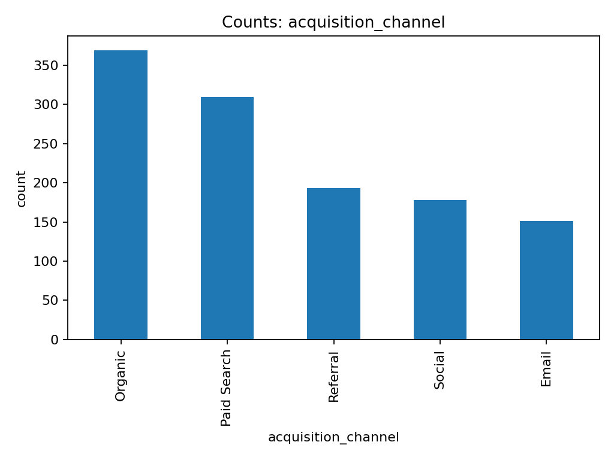

- **Organic** es el canal con mayor número de clientes.
- **Paid Search** ocupa el segundo lugar.
- **Referral**, **Social** y **Email** presentan menor volumen.

La distribución no es uniforme y muestra concentración en pocos canales.

---

### 4.2 Distribución de churn

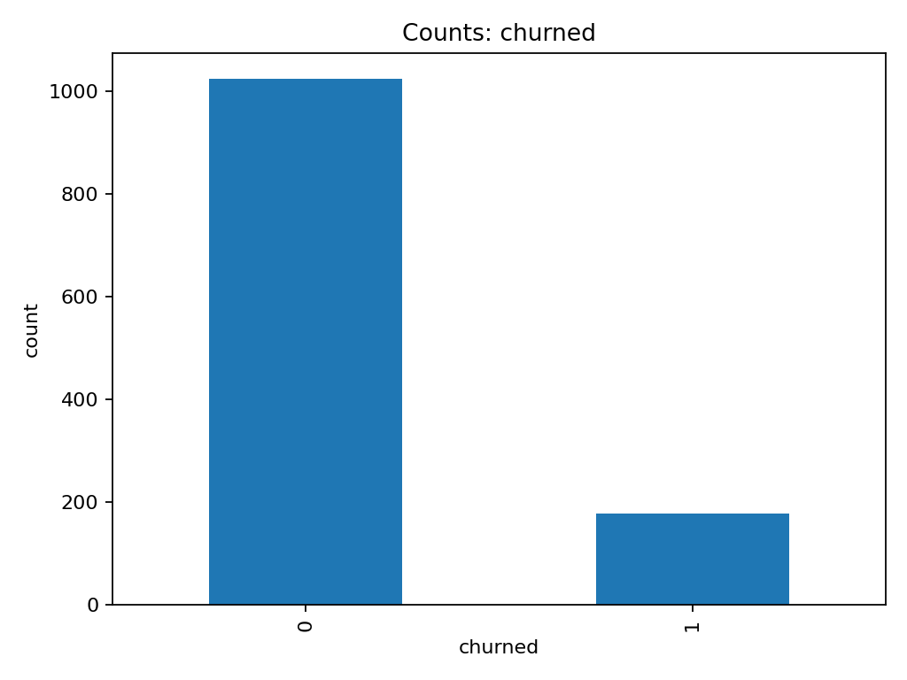

- El dataset presenta un **desbalance de clases**.
- La mayoría de los clientes **no ha churned (0)**.
- Una minoría corresponde a clientes **churned (1)**.

Este comportamiento es típico en problemas de churn.

---

### 4.3 Dispositivo preferido

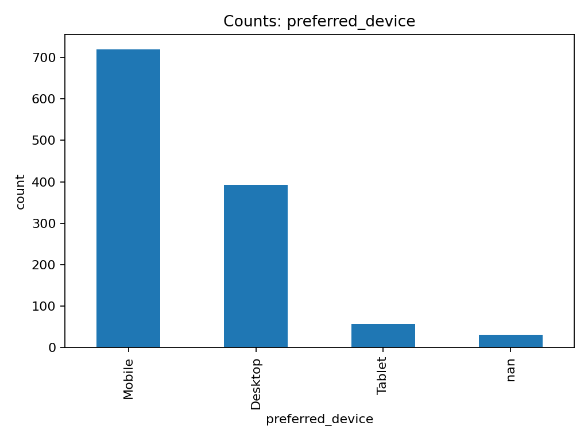

- **Mobile** es el dispositivo predominante.
- **Desktop** es el segundo más frecuente.
- **Tablet** representa una fracción pequeña.
- Existe un pequeño grupo de registros con dispositivo no informado (NaN).

---

### 4.4 Región

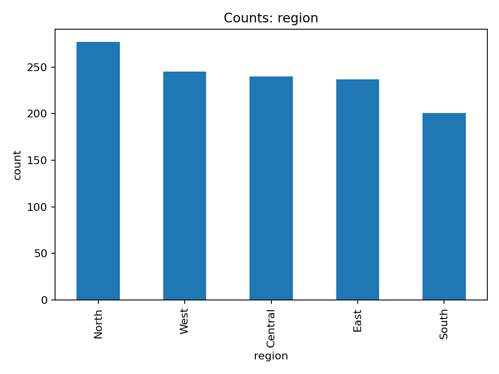

- **North** concentra el mayor número de clientes.
- **South** es la región con menor representación.
- **West**, **Central** y **East** muestran volúmenes similares.

La distribución regional es relativamente equilibrada.

---

## 5. Análisis bivariado inicial (churn vs variables clave)

### 5.1 Revenue bruto últimos 12 meses

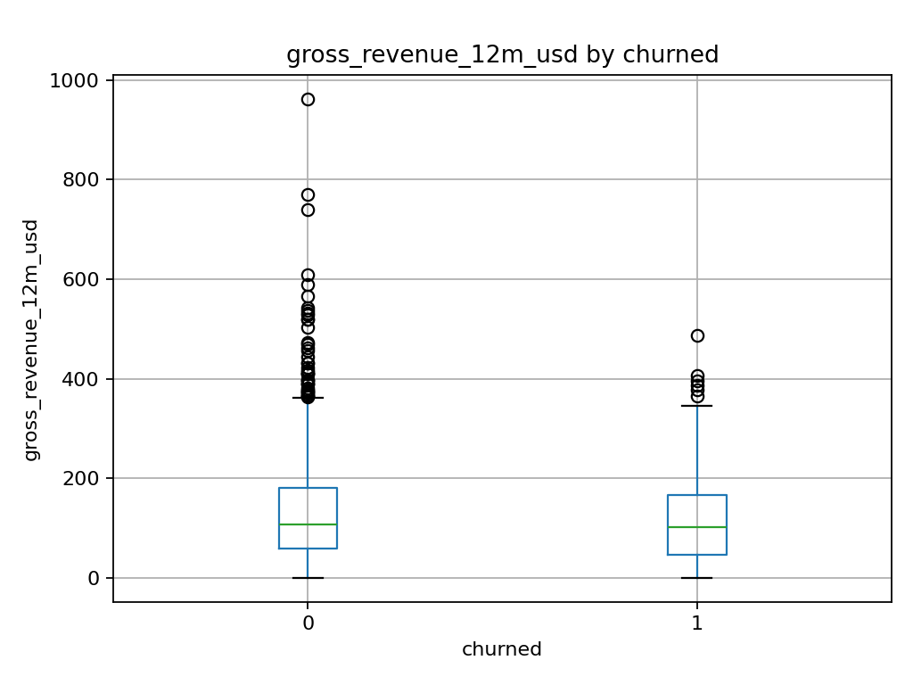

- Las distribuciones de revenue presentan **asimetría positiva**.
- Existen **outliers relevantes** en ambos grupos.
- Se observan diferencias en la dispersión y mediana entre clientes churned y no churned.

Los valores extremos se mantienen para el análisis exploratorio.

---

### 5.2 Net Promoter Score (NPS)

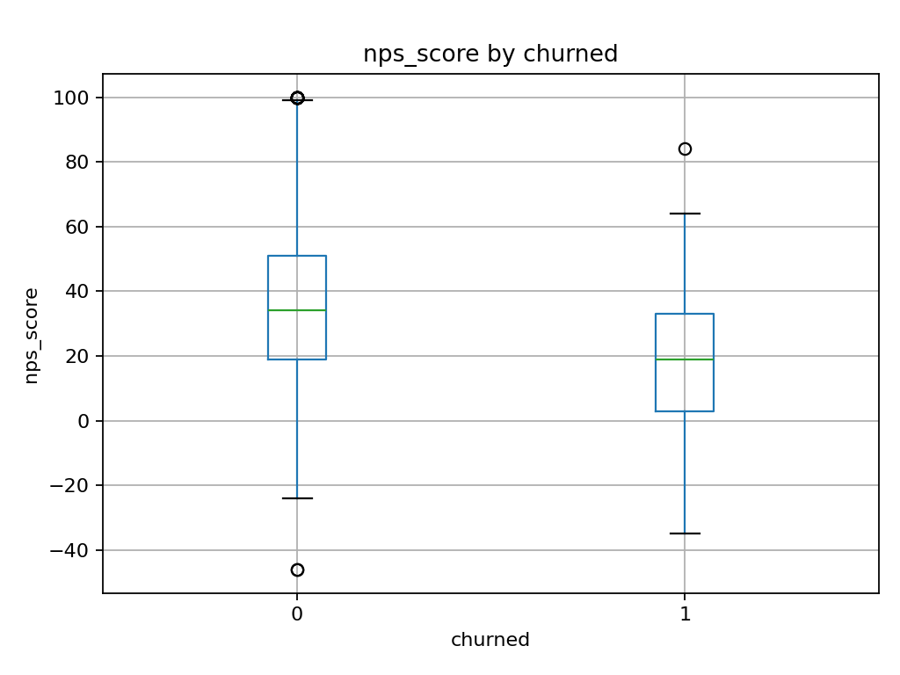

- Los clientes no churned presentan **medianas de NPS más altas**.
- Los clientes churned tienden a concentrarse en valores más bajos.
- Se observa alta dispersión, con valores negativos y positivos.

---

### 5.3 Órdenes en los últimos 90 días

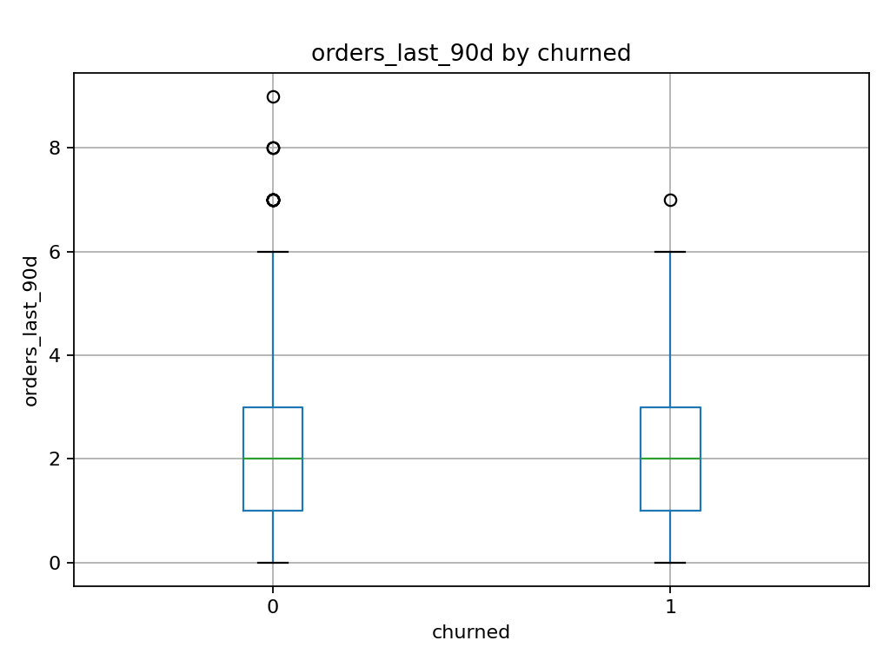

- Los clientes no churned muestran **mayor actividad de compra**.
- Existen outliers en ambos grupos.
- Las diferencias se aprecian principalmente en la mediana y el rango intercuartílico.

---

### 5.4 Sesiones en los últimos 30 días

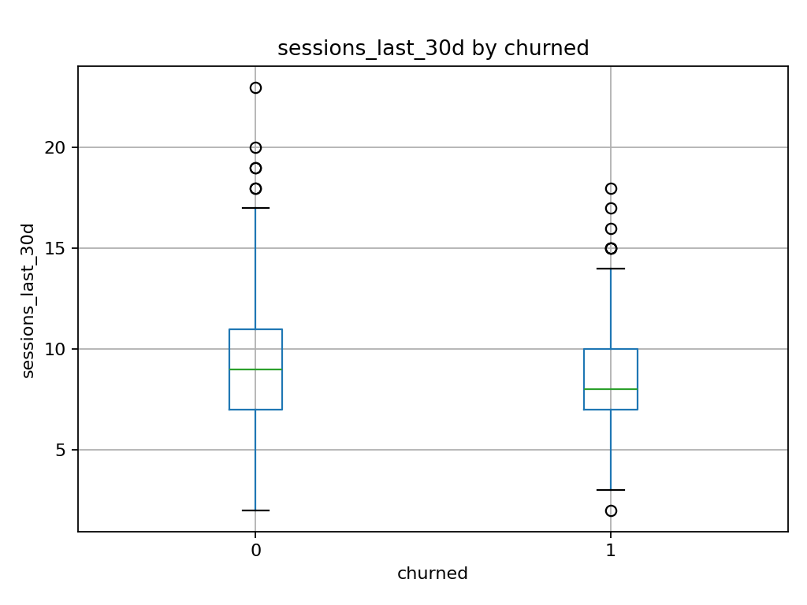

- Los clientes no churned presentan **mayor número de sesiones**.
- Los clientes churned muestran niveles de actividad más bajos.
- Se observa variabilidad en ambos grupos.

---

### 5.5 Tickets de soporte (últimos 90 días)

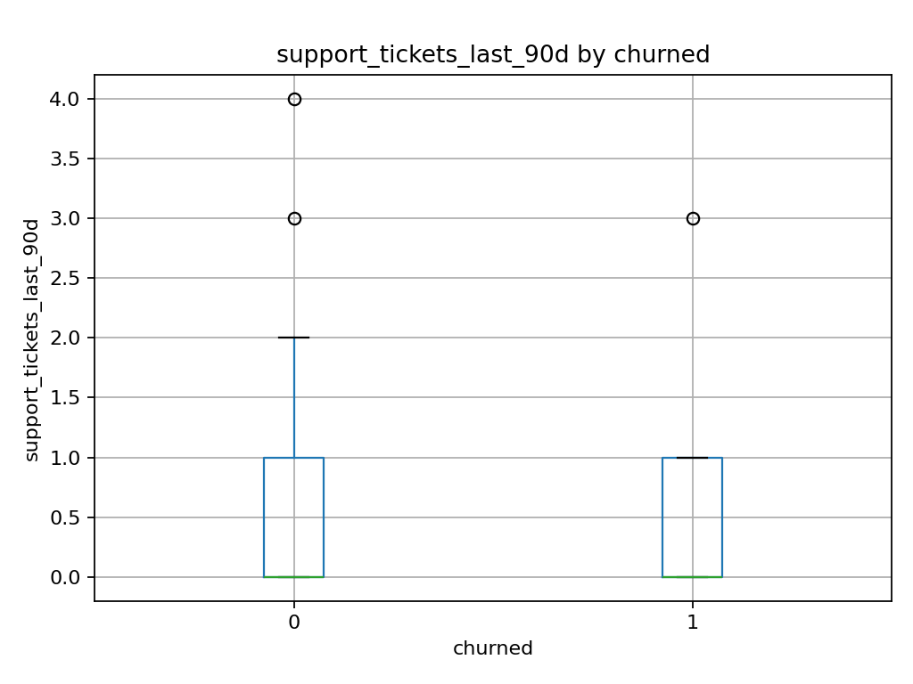

- La mayoría de los clientes no registra tickets de soporte.
- Los tickets son eventos poco frecuentes.
- Existen algunos casos con mayor número de tickets en ambos grupos.

---

## 6. Resumen de hallazgos iniciales (alcance EDA)

A partir del análisis exploratorio se observa que:

- El dataset presenta **condiciones realistas de negocio** (nulos, duplicados, outliers).
- Existen **diferencias descriptivas visibles** entre clientes churned y no churned.
- Las métricas de valor y actividad muestran **alta variabilidad**.
- No se realizan inferencias causales ni predicciones en esta etapa.

Esta sección marca el cierre de la **fase exploratoria inicial**.

---

---
## 7. Análisis de tasas de churn por segmentos categóricos

Con el objetivo de profundizar en las diferencias observadas previamente, se analizan las **tasas promedio de churn** por categoría.  
Este análisis sigue siendo **descriptivo**, sin pruebas estadísticas ni inferencias causales.

---

### 7.1 Tasa de churn por canal de adquisición

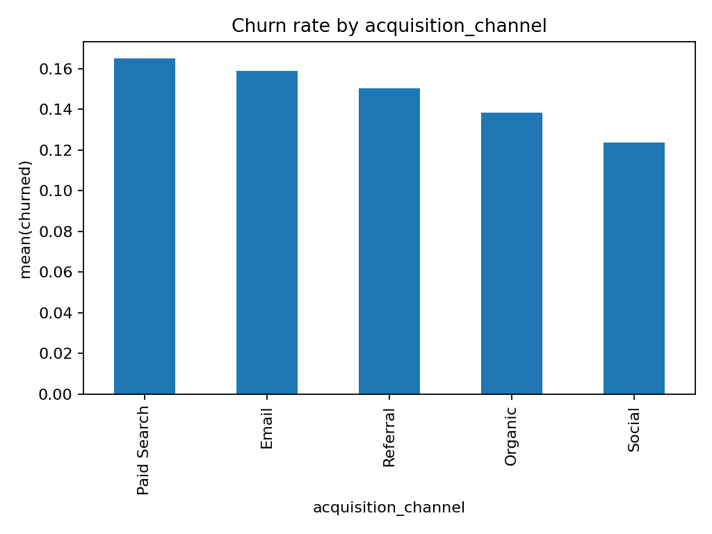

Se observan diferencias claras entre canales:

- **Paid Search** presenta la tasa de churn promedio más alta.
- **Email** y **Referral** muestran tasas intermedias.
- **Organic** se ubica por debajo del promedio general.
- **Social** presenta la tasa de churn más baja.

Esto sugiere que **el canal de adquisición podría estar asociado a distintos perfiles de retención**, aunque esta relación deberá confirmarse en fases posteriores.

---

### 7.2 Tasa de churn por dispositivo preferido

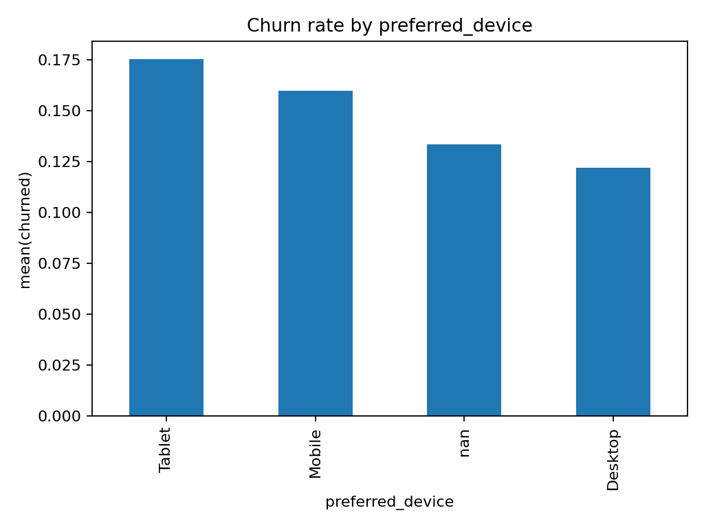

El análisis por dispositivo muestra que:

- **Tablet** presenta la tasa de churn más elevada.
- **Mobile** muestra una tasa intermedia.
- **Desktop** presenta la menor tasa de churn.
- La categoría **NaN** mantiene una tasa comparable a Mobile.

Las diferencias podrían estar relacionadas con patrones de uso o experiencia, sin establecer causalidad en esta etapa.

---

### 7.3 Tasa de churn por región

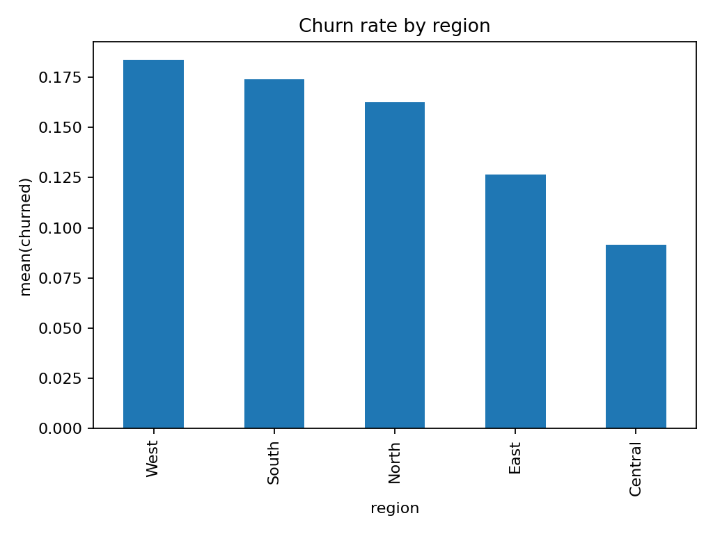

La segmentación regional indica que:

- **West** y **South** presentan las tasas de churn más altas.
- **North** se ubica en un nivel intermedio.
- **East** y **Central** muestran tasas relativamente más bajas.

Esto sugiere posibles diferencias regionales en comportamiento o contexto de mercado.

---

## 8. Análisis de correlación entre variables numéricas

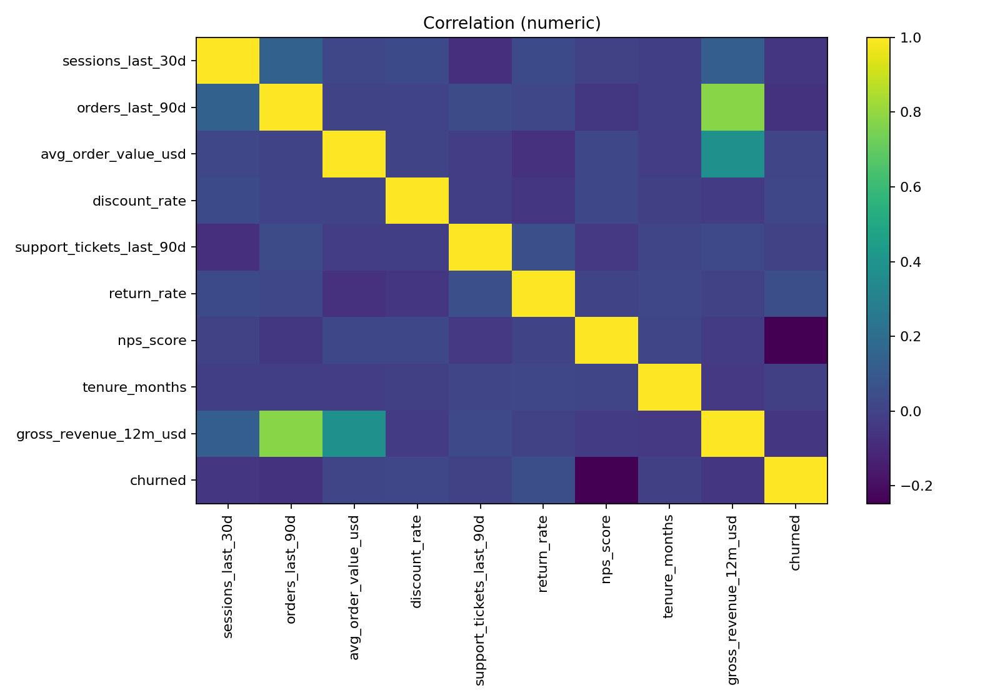

La matriz de correlación permite observar relaciones lineales entre variables numéricas:

- **`nps_score`** muestra la correlación negativa más fuerte con `churned`, lo que indica que valores más altos de NPS tienden a asociarse con menor churn.
- **`orders_last_90d`**, **`gross_revenue_12m_usd`** y **`sessions_last_30d`** presentan correlaciones negativas débiles con churn.
- Variables como **`discount_rate`**, **`support_tickets_last_90d`** y **`avg_order_value_usd`** muestran correlaciones cercanas a cero.
- Se observan correlaciones positivas esperadas entre:
  - órdenes y revenue
  - valor promedio de orden y revenue

En general, el churn aparece como un fenómeno **multifactorial**, sin una única variable dominante.

---

## 9. Análisis univariado de variables numéricas (distribuciones)

### 9.1 Valor promedio de orden (`avg_order_value_usd`)

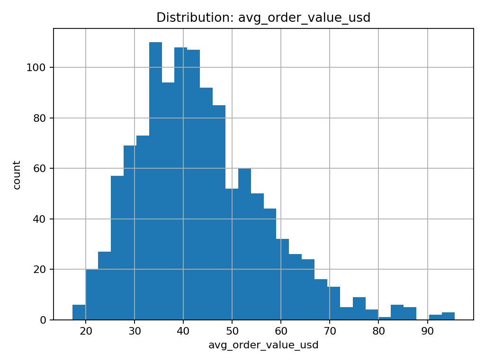

- La distribución presenta **asimetría positiva**.
- La mayoría de los valores se concentra en rangos medios.
- Existen valores altos poco frecuentes que actúan como outliers.

---

### 9.2 Revenue bruto últimos 12 meses (`gross_revenue_12m_usd`)

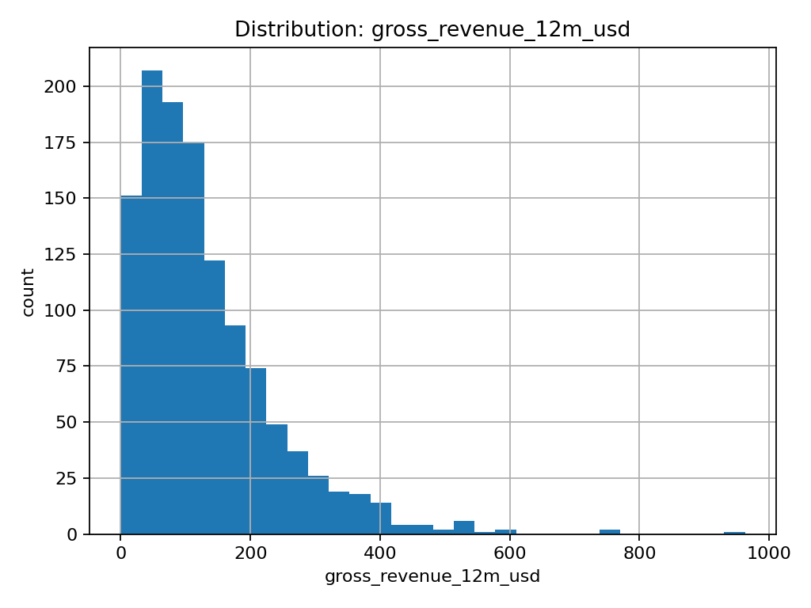

- Distribución fuertemente **sesgada a la derecha**.
- Alta concentración en valores bajos y medios.
- Presencia de outliers extremos, representando clientes de alto valor.

---

### 9.3 Net Promoter Score (`nps_score`)

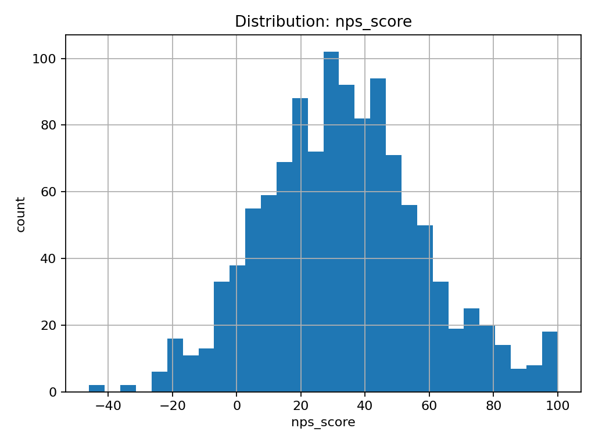

- Distribución amplia, con valores negativos y positivos.
- Concentración principal en rangos medios.
- Alta variabilidad en la percepción de experiencia del cliente.

---

### 9.4 Órdenes en los últimos 90 días (`orders_last_90d`)

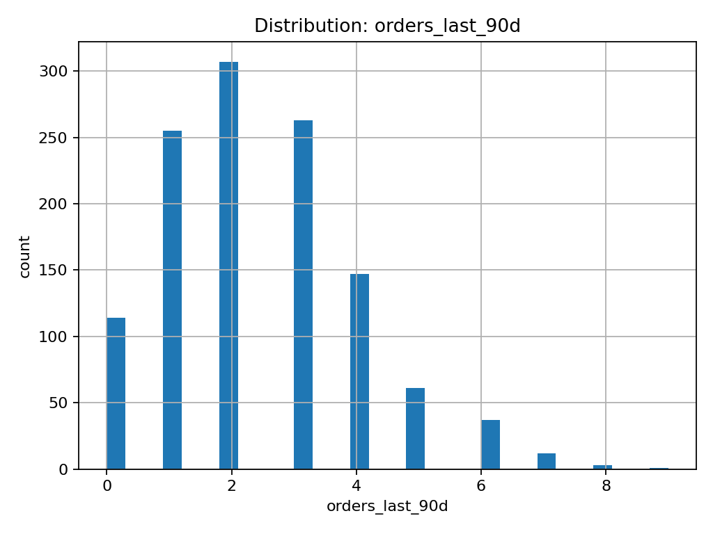

- Variable discreta con concentración en valores bajos (0–3).
- Pocos clientes presentan niveles altos de órdenes.
- Distribución consistente con comportamiento de compra real.

---

### 9.5 Sesiones en los últimos 30 días (`sessions_last_30d`)

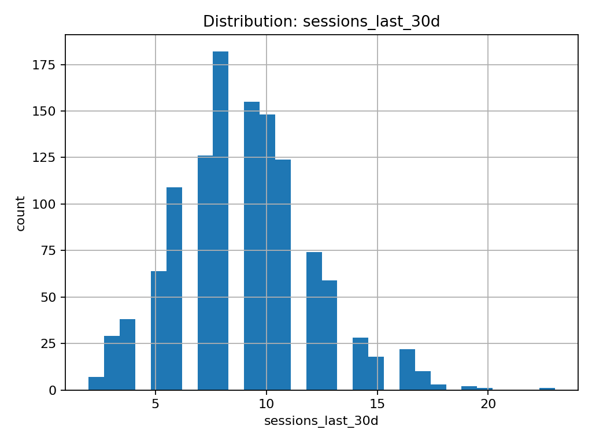

- Distribución aproximadamente unimodal.
- Mayor densidad entre valores medios.
- Algunos valores extremos representan usuarios altamente activos.

---

## 10. Síntesis global del EDA

Integrando todos los análisis exploratorios realizados, se concluye que:

- El dataset presenta **calidad y complejidad realista**.
- Existen **diferencias claras de churn por segmentos categóricos**.
- Las variables numéricas muestran **distribuciones no normales** y presencia de outliers.
- `nps_score` destaca como la variable con mayor asociación lineal con churn.
- No se detectan relaciones lineales fuertes que expliquen el churn por sí solas.

Este EDA cumple su objetivo de **comprender los datos sin imponer modelos ni supuestos**, dejando la base preparada para fases posteriores del análisis.

---

## 11. Conclusión final basada en los resultados del EDA

El análisis exploratorio del dataset revela que el churn en este conjunto de clientes de e-commerce **no ocurre de forma aleatoria**, sino que presenta patrones consistentes asociados al comportamiento, la experiencia del cliente y ciertos segmentos categóricos.

Desde el punto de vista descriptivo, los clientes que no churned tienden a mostrar **mayores niveles de actividad y valor**, reflejados en un mayor número de sesiones recientes, mayor volumen de órdenes y niveles más altos de revenue acumulado. Por el contrario, los clientes churned presentan, en promedio, **menor interacción reciente con la plataforma**, lo que sugiere una relación entre reducción de actividad y abandono.

La experiencia del cliente, medida a través del **Net Promoter Score (NPS)**, muestra una de las diferencias más claras entre ambos grupos. Los clientes churned concentran valores de NPS más bajos y una mayor proporción de experiencias negativas, mientras que los clientes activos presentan medianas de NPS superiores. Esta variable también destaca en el análisis de correlación como la que mantiene la **asociación lineal negativa más fuerte con el churn**, dentro de las métricas analizadas.

En términos de segmentación, el churn presenta variaciones relevantes según el **canal de adquisición**, el **dispositivo preferido** y la **región**. Algunos canales, como Paid Search, muestran tasas de churn superiores, mientras que otros, como Social y Organic, presentan mayor retención relativa. De forma similar, se observan diferencias entre dispositivos, con Desktop mostrando menores tasas de churn frente a Mobile y Tablet. A nivel regional, existen contrastes claros entre regiones con mayor y menor propensión al churn.

El análisis de correlación confirma que el churn es un fenómeno **multifactorial**. Ninguna variable numérica, por sí sola, explica completamente el abandono de clientes. Las métricas de actividad y valor presentan correlaciones negativas débiles con churn, mientras que otras variables, como descuentos, tickets de soporte o valor promedio de orden, muestran relaciones lineales cercanas a cero.

Finalmente, las distribuciones univariadas evidencian que muchas variables clave presentan **asimetría positiva y presencia de outliers**, especialmente en métricas de revenue y valor, lo que indica una base de clientes heterogénea donde unos pocos individuos concentran una parte significativa del valor total.

En conjunto, los resultados del EDA sugieren que el churn en este dataset está asociado a una combinación de **menor actividad reciente, peor experiencia percibida y características específicas de segmentación**, sentando una base clara para análisis posteriores más profundos, como pruebas inferenciales o modelos predictivos, sin que estas conclusiones impliquen causalidad en esta etapa.
El Análisis Exploratorio de Datos delimita claramente su alcance, evitando conclusiones prematuras y manteniendo buenas prácticas analíticas profesionales.